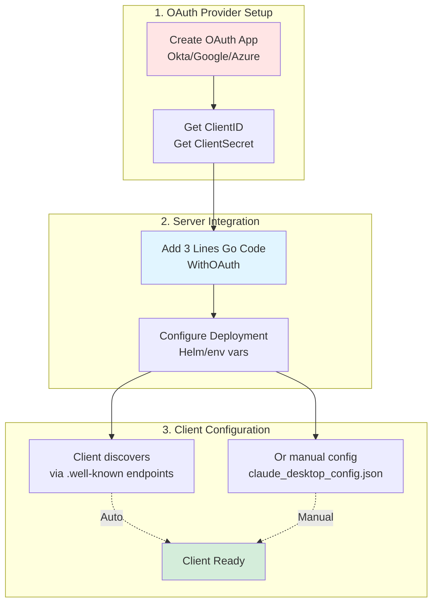
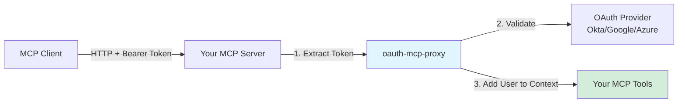
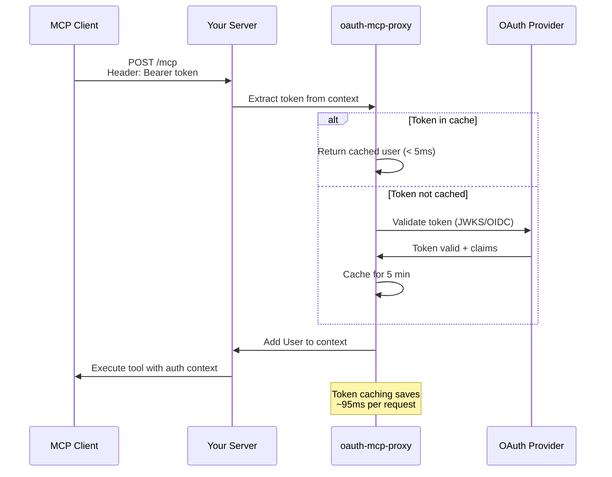
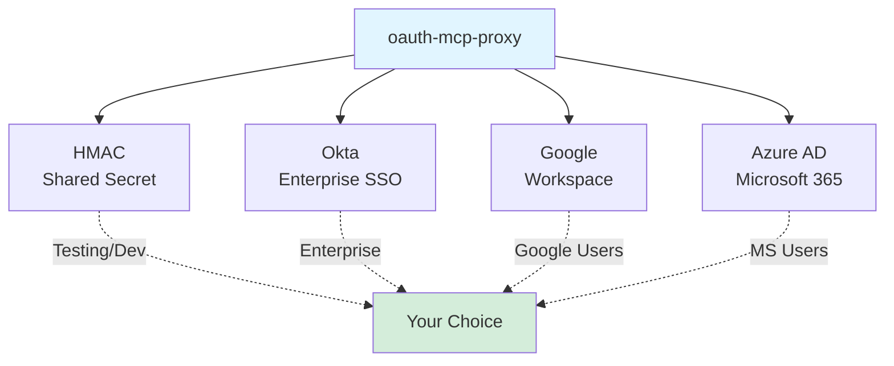

# oauth-mcp-proxy

**OAuth 2.1 authentication library for Go MCP servers.**

Minimal server-side integration (3 lines of Go code) + deployment configuration.

```go
oauthOption, _ := oauth.WithOAuth(mux, &oauth.Config{Provider: "okta", ...})
mcpServer := server.NewMCPServer("My Server", "1.0.0", oauthOption)
// Server-side OAuth complete. Also need: provider setup + deployment config + client config.
```

[](https://github.com/tuannvm/oauth-mcp-proxy/actions/workflows/test.yml)
[](https://github.com/tuannvm/oauth-mcp-proxy/blob/main/go.mod)
[](https://goreportcard.com/report/github.com/tuannvm/oauth-mcp-proxy)
[](https://pkg.go.dev/github.com/tuannvm/oauth-mcp-proxy)
[](https://github.com/tuannvm/oauth-mcp-proxy/releases/latest)
[](https://opensource.org/licenses/MIT)

---

## Complete Setup Overview



**What you need:**
1. OAuth provider configured (one-time setup)
2. Server code updated (3 lines)
3. Deployment configured (environment variables / Helm)
4. Client configured (auto-discovery or manual)

---

## Architecture



**What oauth-mcp-proxy does:**
1. Extracts tokens from HTTP requests
2. Validates against OAuth provider (with caching)
3. Adds authenticated user to context
4. Protects all your tools automatically

---

## Authentication Flow



---

## Quick Start

**Prerequisites:** OAuth app created in your provider (Okta/Google/Azure). See [Provider Guides](docs/providers/).

### 1. Install Library

```bash
go get github.com/tuannvm/oauth-mcp-proxy
```

### 2. Add to Server Code (3 lines)

```go
import oauth "github.com/tuannvm/oauth-mcp-proxy"

mux := http.NewServeMux()
oauthOption, _ := oauth.WithOAuth(mux, &oauth.Config{
    Provider: "okta",                        // or "hmac", "google", "azure"
    Issuer:   os.Getenv("OAUTH_ISSUER"),     // From environment
    Audience: os.Getenv("OAUTH_AUDIENCE"),
})
mcpServer := mcpserver.NewMCPServer("Server", "1.0.0", oauthOption)
```

### 3. Configure Deployment

**Environment variables** (Kubernetes ConfigMap, docker-compose, etc.):
```bash
OAUTH_PROVIDER=okta
OAUTH_ISSUER=https://company.okta.com
OAUTH_AUDIENCE=api://my-server
# For proxy mode: OAUTH_CLIENT_ID, OAUTH_CLIENT_SECRET, etc.
```

**See:** [Configuration Guide](docs/CONFIGURATION.md#environment-variables-pattern)

### 4. Configure Client

**Auto-discovery** (Claude Desktop):
```json
{"mcpServers": {"my-server": {"url": "https://your-server.com/mcp"}}}
```

Client auto-discovers OAuth via `.well-known` endpoints.

**See:** [Client Setup Guide](docs/CLIENT-SETUP.md)

**Complete example:** [examples/simple/](examples/simple/)

---

## Providers



| Provider | Best For | Setup Guide |
|----------|----------|-------------|
| **HMAC** | Testing, development | [Setup](docs/providers/HMAC.md) |
| **Okta** | Enterprise SSO | [Setup](docs/providers/OKTA.md) |
| **Google** | Google Workspace | [Setup](docs/providers/GOOGLE.md) |
| **Azure AD** | Microsoft 365 | [Setup](docs/providers/AZURE.md) |

**Quick config examples:** See [Configuration Guide](docs/CONFIGURATION.md)

---

## Features

- ✅ **3-line integration** - `WithOAuth()` handles everything
- ✅ **Token caching** - 5-minute cache, <5ms validation
- ✅ **Security hardened** - PKCE, redirect validation, defense-in-depth
- ✅ **Pluggable logging** - Integrate with zap, logrus, slog
- ✅ **Instance-scoped** - No globals, thread-safe
- ✅ **OAuth 2.1** - Latest spec compliance

---

## Documentation

📖 **Setup Guides:**
- [Provider Setup](docs/providers/) - OAuth provider configuration (Okta/Google/Azure)
- [Configuration Reference](docs/CONFIGURATION.md) - All server config options
- [Client Setup](docs/CLIENT-SETUP.md) - Client configuration & auto-discovery
- [Deployment](docs/CONFIGURATION.md#environment-variables-pattern) - Helm/env vars

📚 **Reference:**
- [Security Best Practices](docs/SECURITY.md) - Production security guide
- [Troubleshooting](docs/TROUBLESHOOTING.md) - Common issues & solutions
- [Migration from mcp-trino](docs/MIGRATION.md) - Upgrade guide

🎯 **Examples:**
- [Simple Example](examples/simple/) - 3-line integration (recommended)
- [Advanced Example](examples/embedded/) - Lower-level API

📋 **Planning:**
- [v0.1.0 Plan](docs/plan.md) - Current release scope
- [v0.2.0 Plan](docs/plan-standalone.md) - Future standalone mode

---

## Status

**Current Release:** v0.0.1 (Preview)

| Phase | Status |
|-------|--------|
| 0-5 | ✅ **Complete** |
| 6 | ⏳ Next: mcp-trino migration |

**Stable Release (v0.1.0):** After Phase 6 validation complete

---

## Dependencies

4 well-maintained, industry-standard libraries:

- `github.com/mark3labs/mcp-go` v0.41.1 - MCP protocol
- `github.com/coreos/go-oidc/v3` v3.16.0 - OIDC validation
- `github.com/golang-jwt/jwt/v5` v5.3.0 - JWT validation
- `golang.org/x/oauth2` v0.32.0 - OAuth flows

All required for core functionality.

---

## Contributing

Not accepting contributions during extraction phase. After v0.1.0 release, contributions welcome!

**Report issues:** [GitHub Issues](https://github.com/tuannvm/oauth-mcp-proxy/issues)

---

## License

MIT License - See [LICENSE](LICENSE)
