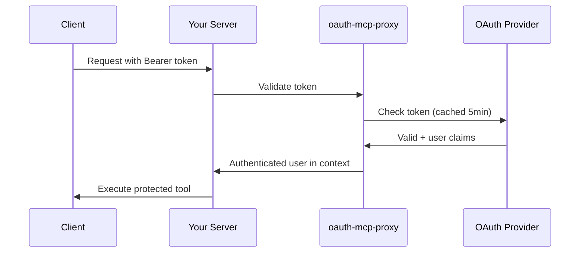

# OAuth MCP proxy

OAuth 2.1 authentication library for Go MCP servers.

**One-time setup:** Configure provider + add `WithOAuth()` to your server.
**Result:** All tools automatically protected with token validation and caching.

```go
// Enable OAuth authentication
_, oauthOption, _ := oauth.WithOAuth(mux, &oauth.Config{
    Provider: "okta",
    Issuer:   "https://your-company.okta.com",
    Audience: "api://your-mcp-server",
})

// All tools now require authentication
mcpServer := server.NewMCPServer("Server", "1.0.0", oauthOption)
```

[](https://github.com/tuannvm/oauth-mcp-proxy/actions/workflows/test.yml)
[](https://github.com/tuannvm/oauth-mcp-proxy/blob/main/go.mod)
[](https://goreportcard.com/report/github.com/tuannvm/oauth-mcp-proxy)
[](https://pkg.go.dev/github.com/tuannvm/oauth-mcp-proxy)
[](https://github.com/tuannvm/oauth-mcp-proxy/releases/latest)
[](https://opensource.org/licenses/MIT)

---

## Why Use This Library?

- **Simple integration** - One `WithOAuth()` call protects all tools
- **Zero per-tool config** - All tools automatically protected
- **Fast token caching** - 5-min cache, <5ms validation
- **Production ready** - Security hardened, battle-tested
- **Multiple providers** - HMAC, Okta, Google, Azure AD

---

## How It Works



**What oauth-mcp-proxy does:**

1. Extracts Bearer tokens from HTTP requests
2. Validates against your OAuth provider (with caching)
3. Adds authenticated user to request context
4. All your tools automatically protected

---

## Quick Start

### 1. Install

```bash
go get github.com/tuannvm/oauth-mcp-proxy
```

### 2. Add to Your Server

```go
import oauth "github.com/tuannvm/oauth-mcp-proxy"

mux := http.NewServeMux()

// Enable OAuth (one time setup)
_, oauthOption, _ := oauth.WithOAuth(mux, &oauth.Config{
    Provider: "okta",                    // or "hmac", "google", "azure"
    Issuer:   "https://your-company.okta.com",
    Audience: "api://your-mcp-server",
    ServerURL: "https://your-server.com",
})

// Create MCP server with OAuth
mcpServer := mcpserver.NewMCPServer("Server", "1.0.0", oauthOption)

// Add tools - all automatically protected
mcpServer.AddTool(myTool, myHandler)

// Setup endpoint
streamable := mcpserver.NewStreamableHTTPServer(
    mcpServer,
    mcpserver.WithHTTPContextFunc(oauth.CreateHTTPContextFunc()),
)
mux.Handle("/mcp", streamable)
```

### 3. Access Authenticated User

```go
func myHandler(ctx context.Context, req mcp.CallToolRequest) (*mcp.CallToolResult, error) {
    user, ok := oauth.GetUserFromContext(ctx)
    if !ok {
        return nil, fmt.Errorf("authentication required")
    }
    // Use user.Username, user.Email, user.Subject
}
```

Your MCP server now requires OAuth authentication.

---

## Examples

| Example | Description |
|---------|-------------|
| **[Simple](examples/simple/)** | Minimal setup - copy/paste ready |
| **[Advanced](examples/advanced/)** | All features - ConfigBuilder, WrapHandler, LogStartup |

---

## Supported Providers

| Provider | Best For | Setup Guide |
|----------|----------|-------------|
| **HMAC** | Testing, development | [docs/providers/HMAC.md](docs/providers/HMAC.md) |
| **Okta** | Enterprise SSO | [docs/providers/OKTA.md](docs/providers/OKTA.md) |
| **Google** | Google Workspace | [docs/providers/GOOGLE.md](docs/providers/GOOGLE.md) |
| **Azure AD** | Microsoft 365 | [docs/providers/AZURE.md](docs/providers/AZURE.md) |

---

## Documentation

**Getting Started:**

- [Configuration Guide](docs/CONFIGURATION.md) - All config options
- [Client Setup](docs/CLIENT-SETUP.md) - Client configuration
- [Provider Setup](docs/providers/) - OAuth provider guides

**Advanced:**

- [Security Guide](docs/SECURITY.md) - Production best practices
- [Troubleshooting](docs/TROUBLESHOOTING.md) - Common issues

---

## License

MIT License - See [LICENSE](LICENSE)
