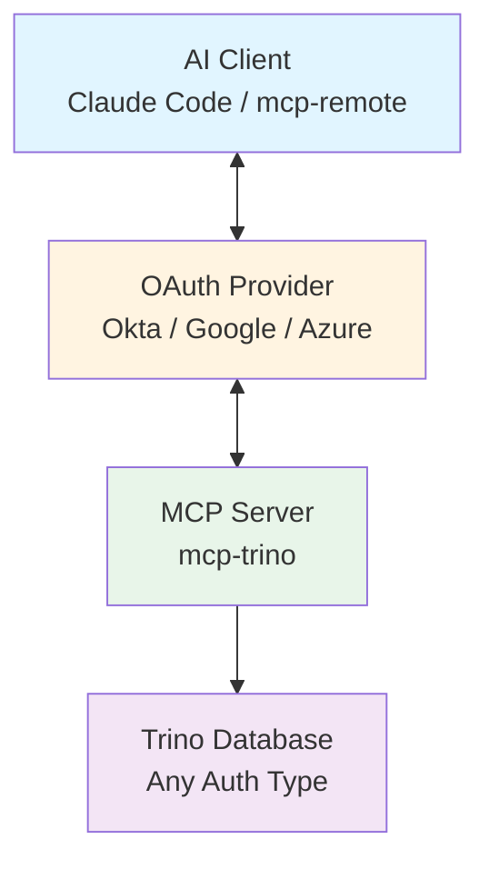
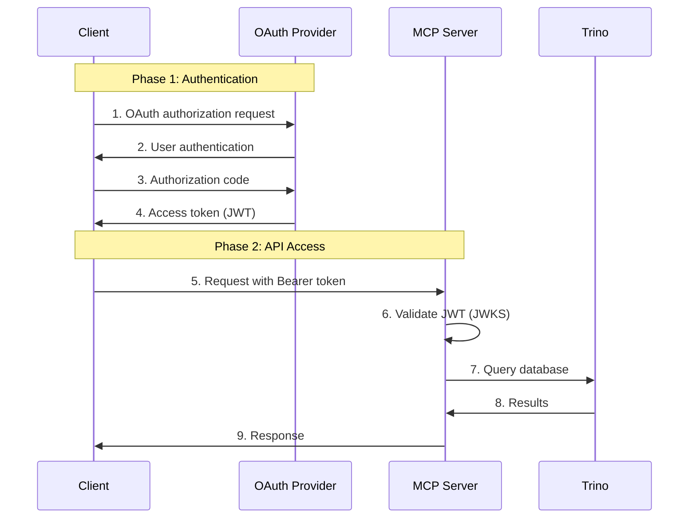
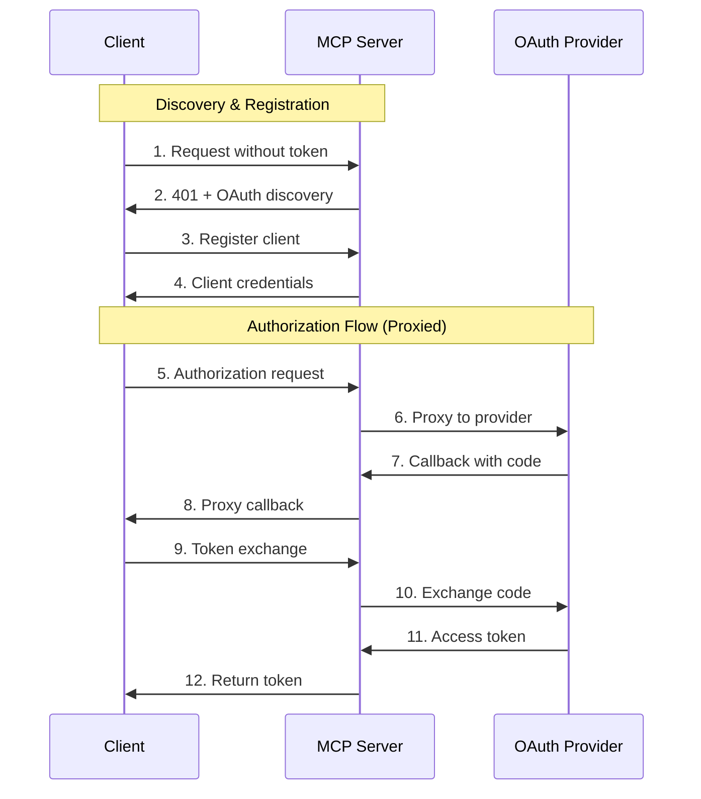
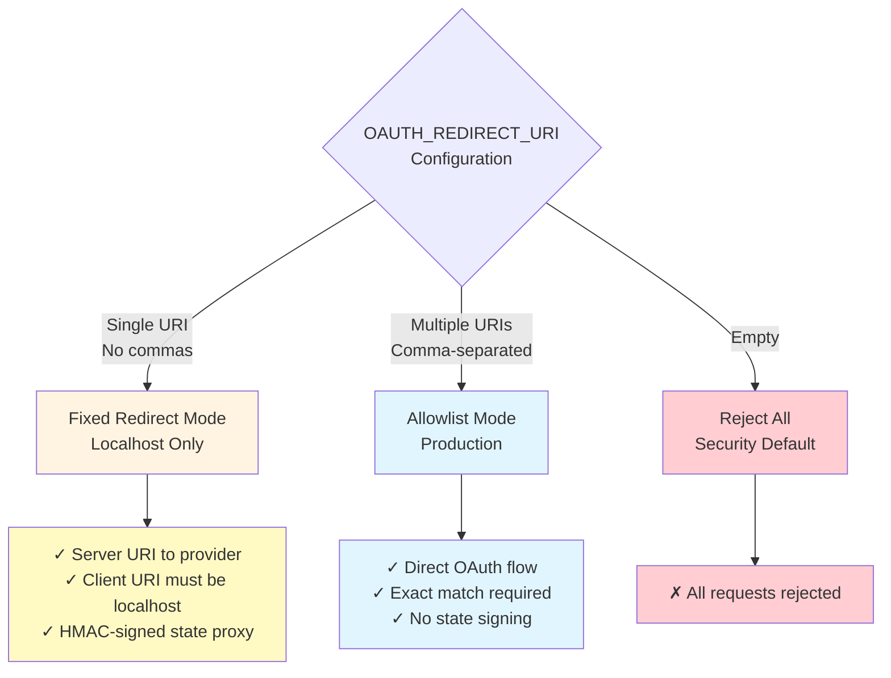
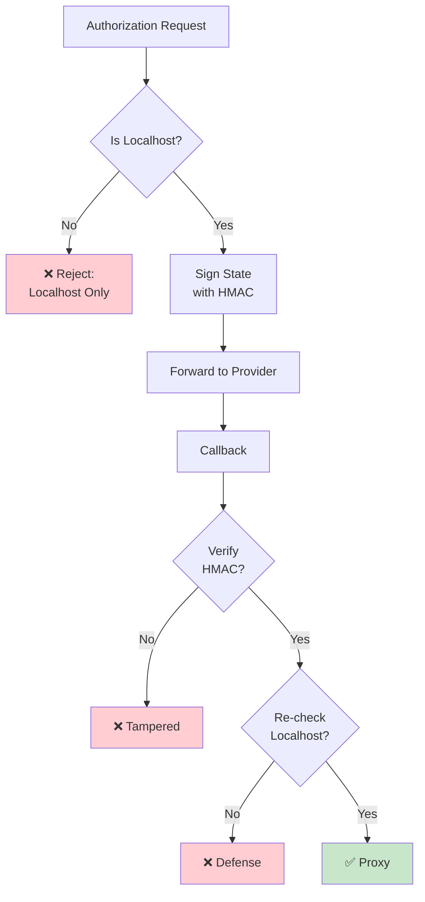
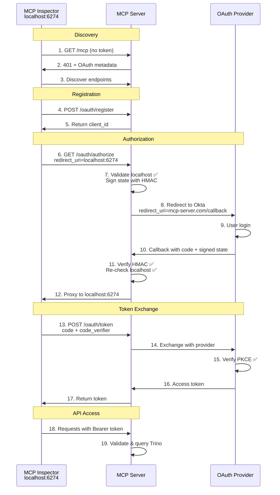
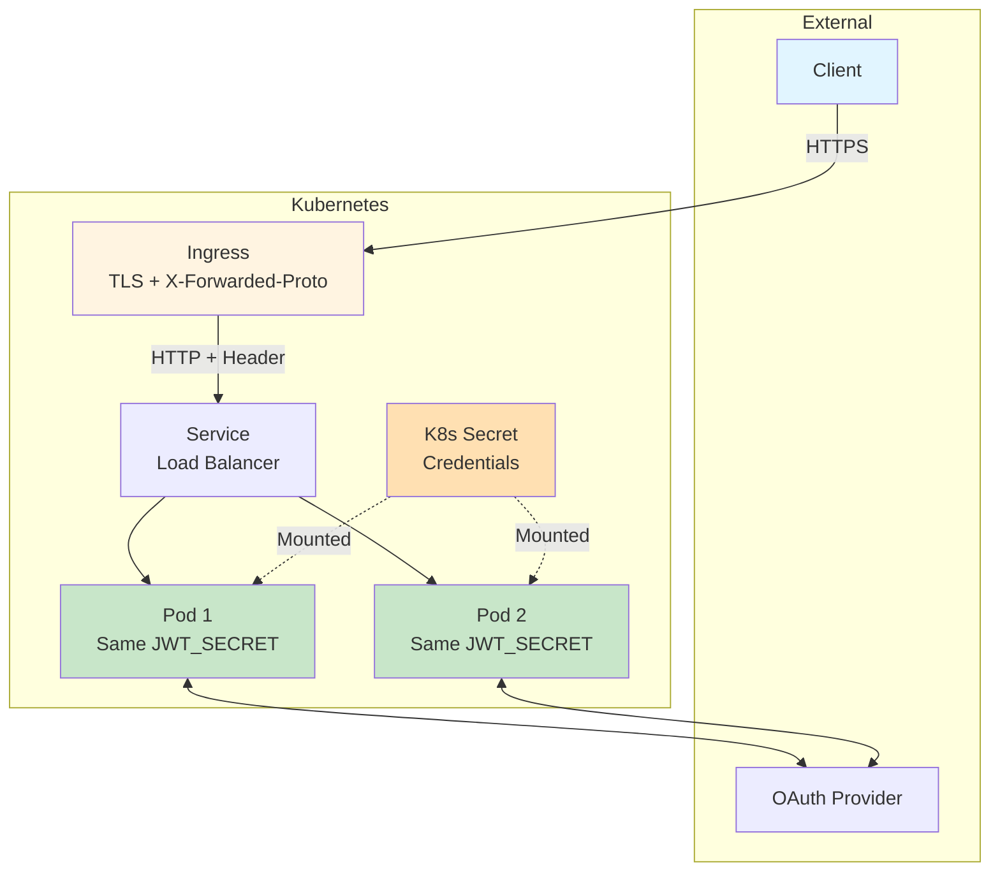
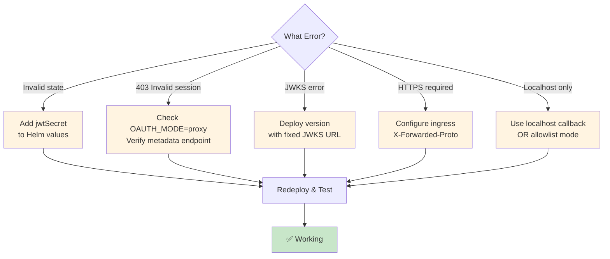

# OAuth 2.0 Authentication Architecture

This document outlines the OAuth 2.0 authentication architecture for the mcp-trino server, providing secure access control for AI assistants accessing Trino databases.

## Important Security Notes

⚠️ **Critical Requirements:**

- **Fixed Redirect Mode**: ONLY accepts localhost redirect URIs (development/testing only)
- **Allowlist Mode**: Requires exact URI matches (production deployments)
- **JWT_SECRET**: Must be configured for multi-pod deployments to ensure state verification consistency
- **PKCE**: Optional but strongly recommended per OAuth 2.1 standard
- **HTTPS**: Required for all non-localhost redirect URIs

✅ **Security Guarantees:**

- HMAC-SHA256 signed state prevents tampering
- Localhost-only restriction prevents open redirect attacks in fixed mode
- Defense-in-depth: Multiple independent validation layers
- Constant-time comparison prevents timing attacks

## Architecture Overview

The mcp-trino server implements OAuth 2.0 as a **resource server**, validating JWT tokens from clients while maintaining existing Trino authentication methods.



## OAuth Operational Modes

The MCP server supports two distinct operational modes:

### Native Mode (Direct OAuth)

**How it works:**

1. Client authenticates directly with OAuth provider (Okta, Google, Azure)
2. Client receives JWT access token from provider
3. Client sends Bearer token to MCP server with each request
4. MCP server validates token using JWKS from OAuth provider
5. MCP server grants access to Trino resources

**Configuration Requirements:**

- **Server Side**: `OIDC_ISSUER`, `OIDC_AUDIENCE` only
- **Client Side**: Must configure OAuth client_id and provider endpoints

**Security Model:**

- ✅ Zero OAuth secrets stored in MCP server
- ✅ Most secure - direct trust relationship
- ✅ Simplified server deployment
- ⚠️ Requires OAuth-capable clients (Claude.ai, etc.)



### Proxy Mode (OAuth Proxy)

**How it works:**

1. Client makes request to MCP server without any OAuth configuration
2. MCP server returns 401 with OAuth discovery information
3. Client discovers OAuth endpoints from MCP server metadata
4. MCP server proxies entire OAuth flow to upstream provider
5. Client receives token through MCP server proxy
6. Client uses token for subsequent API calls

**Configuration Requirements:**

- **Server Side**: Full OAuth configuration (client_id, client_secret, issuer, audience, redirect URIs)
- **Client Side**: Zero OAuth configuration needed

**Security Model:**

- ✅ Centralized credential management
- ✅ Works with any MCP client
- ✅ No client-side OAuth configuration
- ⚠️ Requires OAuth secrets in server environment
- ⚠️ Fixed mode limited to localhost callbacks (development only)
- ✅ Allowlist mode for production deployments



## OAuth Configuration Guide

### Environment Variables

| Variable | Native Mode | Proxy Mode | Purpose |
|----------|-------------|------------|---------|
| `OAUTH_ENABLED` | Required | Required | Enable OAuth authentication |
| `OAUTH_MODE` | `native` | `proxy` | Operational mode |
| `OAUTH_PROVIDER` | `okta/google/azure/hmac` | `okta/google/azure/hmac` | Provider selection |
| `JWT_SECRET` | HMAC: Token validation | HMAC: Tokens<br/>All providers: State signing | HMAC signing key |
| `OIDC_ISSUER` | Required | Required | Provider issuer URL |
| `OIDC_AUDIENCE` | Required | Required | Token audience |
| `OIDC_CLIENT_ID` | ❌ Not used | ✅ Required | OAuth app client ID |
| `OIDC_CLIENT_SECRET` | ❌ Not used | ⚠️ Public: No<br/>Confidential: Yes | OAuth app secret |
| `OAUTH_REDIRECT_URI` | ❌ Not used | ✅ Required | Fixed or allowlist URIs |

### Redirect URI Configuration Modes

**Fixed Redirect Mode (Single URI):**

- Configuration: `OAUTH_REDIRECT_URI=https://mcp-server.com/oauth/callback` (no commas)
- Behavior: Server uses fixed URI with OAuth provider, proxies callback to client
- Client URIs: **MUST be localhost only** (localhost, 127.0.0.1, ::1)
- State Handling: HMAC-signed to prevent tampering
- Use Case: Development tools (MCP Inspector, mcp-remote on localhost)
- Security: Localhost-only prevents open redirect attacks

**Allowlist Mode (Multiple URIs):**

- Configuration: `OAUTH_REDIRECT_URI=https://app1.com/cb,https://app2.com/cb` (comma-separated)
- Behavior: Direct OAuth flow, no proxy
- Client URIs: Must exactly match one URI in allowlist
- State Handling: Standard OAuth state (no signing needed)
- Use Case: Production deployments with known redirect URIs
- Security: Exact match prevents open redirect attacks

**Security Default (Empty):**

- Configuration: `OAUTH_REDIRECT_URI=` (empty or not set)
- Behavior: Rejects all redirect URIs
- Use Case: Fail-closed security when OAuth not properly configured



## Security Architecture

### Defense-in-Depth Model

The implementation uses four independent security layers. Even if one layer is compromised, the others prevent attacks.

**Layer 1: Request Validation**

- Redirect URI format validation (URL parsing, scheme check)
- HTTPS enforcement for non-localhost URIs
- Fragment rejection per OAuth 2.0 specification
- Localhost detection (hostname parsing to prevent subdomain attacks)

**Layer 2: State Integrity Protection**

- HMAC-SHA256 signature using JWT_SECRET
- Deterministic signing algorithm (consistent field ordering)
- Constant-time signature comparison
- Automatic key generation with warnings if not configured

**Layer 3: Authorization Code Protection (PKCE)**

- Code challenge/verifier mechanism
- Custom HTTP transport adds code_verifier to token requests
- Prevents code theft even if authorization code is intercepted
- Supported but optional (strongly recommended)

**Layer 4: Token Validation**

- JWT signature verification using JWKS
- Audience claim validation
- Expiration timestamp checks
- Token caching with SHA256 hashing

### Fixed Redirect Mode Security Flow

This mode is designed for development tools and enforces strict localhost-only security:

**Authorization Phase:**

1. Validate redirect URI is well-formed URL
2. Check scheme is http or https
3. Reject if fragment present (OAuth 2.0 spec)
4. **Critical**: Verify hostname is localhost/127.0.0.1/::1
5. If not localhost → Reject with error
6. If localhost → Sign state with HMAC
7. Forward to OAuth provider using server's fixed redirect URI

**Callback Phase:**

8. Receive callback from OAuth provider
9. Decode and verify HMAC signature
10. Extract client redirect URI from signed state
11. **Defense in depth**: Re-validate client URI is localhost
12. If signature invalid or not localhost → Reject
13. If valid → Proxy to client's localhost callback



### Allowlist Mode Security Flow

This mode is for production and enforces strict exact-match validation:

**Process:**

1. Parse client's redirect URI
2. Compare against allowlist using exact string matching
3. If no match → Reject request
4. If match → Use client's URI directly with OAuth provider
5. OAuth provider calls client directly (no proxy)
6. No state signing needed (standard OAuth flow)

**Security Properties:**

- Fail-closed: Empty allowlist rejects all requests
- No substring matching (prevents subdomain attacks)
- No pattern matching (prevents bypass attempts)
- Whitespace trimmed for comparison

## Attack Prevention

### State Tampering Attack

**Attack Scenario:**
An attacker intercepts a valid signed state parameter and attempts to modify the redirect URI to point to their own server.

**Prevention Mechanism:**

1. State contains: `{state: "csrf-token", redirect: "http://localhost:6274", sig: "hmac..."}`
2. Attacker decodes base64 and changes redirect to "<https://evil.com>"
3. Attacker re-encodes and sends to callback endpoint
4. Server recalculates HMAC over original data
5. Signatures don't match → Request rejected

**Why it works:**

- HMAC is cryptographically tied to the exact data
- Any modification invalidates the signature
- Attacker cannot forge signature without JWT_SECRET
- Even with leaked JWT_SECRET, localhost validation prevents external redirects

### Open Redirect Attack

**Attack Scenario Fixed Mode:**
Attacker tries to use MCP server as open redirect by requesting authorization with `redirect_uri=https://evil.com/steal`.

**Prevention:**

- Server validates redirect URI is localhost
- `evil.com` is not localhost → Request rejected immediately
- Attack blocked before any OAuth flow begins

**Attack Scenario Allowlist Mode:**
Attacker tries redirect to unauthorized URI.

**Prevention:**

- Server checks exact string match against allowlist
- No match → Request rejected
- No wildcards or pattern matching prevents bypass

### Authorization Code Theft

**Attack Scenario:**
Attacker intercepts authorization code in transit (network sniffing, malware, etc.).

**Prevention (PKCE):**

1. Client generates random `code_verifier`
2. Client sends SHA256 hash (`code_challenge`) in authorization request
3. OAuth provider stores the challenge
4. When exchanging code for token, client must provide original `code_verifier`
5. Provider verifies hash(code_verifier) == code_challenge
6. Without verifier, code is useless

**Result:** Even if attacker steals authorization code, they cannot exchange it for access token.

## Metadata Endpoints

### Discovery Endpoint Behavior

The server exposes multiple discovery endpoints that return different information based on operational mode:

**`/.well-known/oauth-authorization-server`**

- **Native Mode**: Returns OAuth provider endpoints (Okta, Google, etc.)
- **Proxy Mode**: Returns MCP server endpoints
- Purpose: Tells clients where to find authorization, token, and registration endpoints

**`/.well-known/oauth-protected-resource`**

- **Native Mode**: `authorization_servers: ["{oauth-provider-url}"]`
- **Proxy Mode**: `authorization_servers: ["{mcp-server-url}"]`
- Purpose: Critical for client routing - determines if client talks to provider directly or via proxy

**`/.well-known/jwks.json`** (Proxy mode only)

- Proxies JWKS from upstream OAuth provider
- Okta: Fetches from `{issuer}/oauth2/v1/keys`
- Google: Fetches from `https://www.googleapis.com/oauth2/v3/certs`
- Returns cached keys (5-minute cache)

### Complete OAuth Flow - Proxy Mode with Fixed Redirect

This diagram shows the complete flow for development tools like MCP Inspector:



## Configuration Examples

### Development Setup - Fixed Redirect Mode

**Helm Values:**

```yaml
trino:
  oauth:
    enabled: true
    mode: "proxy"
    provider: "okta"
    jwtSecret: "your-256-bit-hex-key"  # Required for state signing
    redirectURIs: "https://mcp-server.com/oauth/callback"  # Single URI
    oidc:
      issuer: "https://company.okta.com"
      audience: "https://mcp-server.com"
      clientId: "your-okta-app-client-id"
      clientSecret: "your-okta-app-secret"
```

**What this enables:**

- MCP Inspector can use `http://localhost:6274/callback`
- mcp-remote can use any dynamic localhost port
- All localhost callbacks are accepted and proxied securely
- State signing ensures integrity across pod restarts

**Security:**

- Localhost-only restriction prevents open redirect
- HMAC signing prevents state tampering
- Multi-pod safe with configured jwtSecret

### Production Setup - Allowlist Mode

**Helm Values:**

```yaml
trino:
  oauth:
    enabled: true
    mode: "proxy"
    provider: "okta"
    jwtSecret: "your-256-bit-hex-key"  # For HMAC provider or consistency
    redirectURIs: "https://app1.company.com/callback,https://app2.company.com/callback"
    oidc:
      issuer: "https://company.okta.com"
      audience: "https://api.company.com"
      clientId: "production-client-id"
      clientSecret: "production-client-secret"
```

**What this enables:**

- Only app1.company.com and app2.company.com callbacks allowed
- Direct OAuth flow (no proxy)
- Maximum security with exact matching
- Production-grade deployment

## Security Model Details

### HMAC State Signing

**Purpose:** Prevent attackers from tampering with redirect URIs in the state parameter.

**How it works:**

1. **Signing (Authorization)**:
   - Create data string: `state={csrf-token}&redirect={client-redirect-uri}`
   - Calculate: `signature = HMAC-SHA256(data, JWT_SECRET)`
   - Combine: `{state, redirect, sig}` → base64 encode
   - Send encoded state to OAuth provider

2. **Verification (Callback)**:
   - Decode base64 → Extract signature
   - Recalculate: `expected = HMAC-SHA256(state + redirect, JWT_SECRET)`
   - Compare: `hmac.Equal(received_sig, expected_sig)` (constant-time)
   - If match → Extract original state and redirect
   - If mismatch → Reject as tampered

**Key Properties:**

- Uses same JWT_SECRET across all pods (must be configured)
- Deterministic algorithm ensures verification succeeds
- Constant-time comparison prevents timing attacks
- Defense in depth: Localhost also re-validated after verification

### Localhost Detection

**Purpose:** Ensure fixed redirect mode only accepts localhost callbacks, preventing open redirect attacks.

**Implementation:**

- Parse full URI to extract hostname
- Convert hostname to lowercase
- Check if hostname is one of:
  - `localhost`
  - `127.0.0.1` (IPv4 loopback)
  - `::1` (IPv6 loopback)

**Attack Prevention:**

- `localhost.evil.com` → `false` (subdomain attack)
- `evil-localhost.com` → `false` (similar name attack)
- `http://localhost@evil.com` → `false` (userinfo attack)

**Validation Points:**

- Authorization request: Validate before signing state
- Callback handler: Re-validate after HMAC verification (defense in depth)

## Deployment Architecture

### Kubernetes Production Deployment

**Infrastructure Components:**

- **Ingress**: Terminates TLS, must set `X-Forwarded-Proto: https` header
- **Multiple Pods**: Horizontal scaling with shared JWT_SECRET from Kubernetes Secret
- **Service**: ClusterIP for internal load balancing
- **Secrets**: Store jwtSecret and clientSecret securely

**Network Flow:**



**Critical Configuration:**

- All pods must mount same jwtSecret for state verification
- Ingress must set X-Forwarded-Proto header for HTTPS detection
- OAuth credentials stored in Kubernetes Secrets, not ConfigMaps

## Bug Fixes & Troubleshooting

### Issue 1: Incorrect Okta JWKS URL

**Problem:**

- JWKS endpoint was using `{issuer}/.well-known/jwks.json`
- Okta returns 404 for this path
- Correct Okta path is `{issuer}/oauth2/v1/keys`

**Symptoms:**

- mcp-remote fails with "JWKS endpoint error"
- Claude Code shows 502 Bad Gateway when accessing JWKS

**Solution:**

```
Before: {issuer}/.well-known/jwks.json → 404
After:  {issuer}/oauth2/v1/keys → 200 OK
```

**Files Fixed:**

- `internal/oauth/handlers.go:211`
- `internal/oauth/metadata.go:296`

### Issue 2: Protected Resource Metadata Mode Mismatch

**Problem:**
The `/.well-known/oauth-protected-resource` endpoint always returned OAuth provider URL in `authorization_servers`, even when configured in proxy mode.

**Impact:**

- mcp-remote received: `"authorization_servers": ["https://okta.com"]`
- mcp-remote tried to register with Okta directly
- Okta returned: `403 Invalid session` (no valid session with Okta)
- Client unable to complete OAuth flow

**Solution:**
Mode-aware response:

- **Proxy Mode**: `"authorization_servers": ["{mcp-server-url}"]` → Client talks to MCP server
- **Native Mode**: `"authorization_servers": ["{okta-url}"]` → Client talks to Okta directly

**File Fixed:** `internal/oauth/metadata.go:126-136`

### Issue 3: Missing JWT_SECRET in Multi-Pod Deployment

**Problem:**
Without configured jwtSecret, each pod generates its own random signing key:

- Pod A signs state during authorization
- Pod B receives callback, uses different key
- Signature verification fails → "Invalid state parameter"

**Symptoms:**

- Intermittent "Invalid state parameter" errors
- Errors occur randomly (depends on which pod handles callback)
- Error rate increases with more pod replicas

**Solution:**
Configure jwtSecret in Helm values:

```yaml
trino:
  oauth:
    jwtSecret: "$(openssl rand -hex 32)"  # Same across all pods
```

This ensures all pods use the same HMAC signing key for state parameters.

## Troubleshooting Guide

### Common Error Messages

**"Invalid state parameter"**

- Cause: JWT_SECRET not configured or differs across pods
- Solution: Set jwtSecret in Helm values, redeploy
- Verification: Check all pods have same JWT_SECRET env var

**"403 Invalid session" from Okta**

- Cause: Protected resource metadata pointing to wrong authorization server
- Solution: Verify OAUTH_MODE=proxy is set correctly
- Verification: Check `/.well-known/oauth-protected-resource` returns MCP server URL

**"JWKS endpoint error" (502)**

- Cause: Incorrect Okta JWKS URL
- Solution: Deploy version with fixed JWKS path
- Verification: Test `/.well-known/jwks.json` returns public keys

**"Fixed redirect mode only allows localhost"**

- Cause: Trying to use production redirect URI in fixed mode
- Solution: Either use localhost callback OR switch to allowlist mode
- Verification: Check OAUTH_REDIRECT_URI contains comma (allowlist) or is single URL (fixed)

**"HTTPS required for OAuth endpoints"**

- Cause: Ingress not setting X-Forwarded-Proto header
- Solution: Configure ingress to set `X-Forwarded-Proto: https`
- Verification: Check request headers at pod level

### Error Resolution Flowchart



## OAuth 2.0 Compliance

### Implemented Standards

| RFC | Standard | Status | Notes |
|-----|----------|--------|-------|
| RFC 6749 | OAuth 2.0 Core | ✅ Full | Authorization code flow |
| RFC 7636 | PKCE | ✅ Supported | Optional but recommended |
| RFC 8414 | Metadata | ✅ Full | Discovery endpoints |
| RFC 7591 | Dynamic Registration | ✅ Full | Client registration |
| RFC 9728 | Protected Resource | ✅ Full | Resource metadata |

### Security Best Practices Compliance

| Practice | Status | Implementation |
|----------|--------|----------------|
| Exact redirect URI matching | ✅ | Allowlist mode |
| State parameter CSRF protection | ✅ | Required + HMAC-signed in fixed mode |
| PKCE for public clients | ✅ | Supported, recommended |
| TLS/HTTPS enforcement | ✅ | Non-localhost URIs |
| Constant-time comparisons | ✅ | HMAC verification |
| Input validation | ✅ | Length limits, format checks |
| Defense in depth | ✅ | Multiple validation layers |

## Client Compatibility

### Tested Clients

**MCP Inspector (Browser-based)**

- ✅ OAuth discovery via 401 response
- ✅ Dynamic client registration
- ✅ Localhost callback (<http://localhost:6274>)
- ✅ PKCE flow
- Status: Fully working

**mcp-remote CLI**

- ✅ Automatic port selection
- ✅ OAuth discovery
- ✅ Client registration
- ✅ Localhost callback with dynamic port
- Status: Working after bug fixes

**Claude Code**

- ✅ IDE integration
- ✅ OAuth discovery
- ✅ mcp-remote transport
- Status: Working after bug fixes

**Generic OAuth 2.0 Clients**

- ✅ Standard OAuth 2.0 flow
- ✅ PKCE support
- ⚠️ Must use localhost in fixed mode OR be in allowlist

## Production Deployment Recommendations

### Required Configuration Checklist

**Pre-Deployment:**

- [ ] Configure `jwtSecret` in Helm values (use `openssl rand -hex 32`)
- [ ] Set `OAUTH_MODE=proxy` for mcp-remote/Claude Code support
- [ ] Choose redirect URI mode:
  - Development: Single URI (fixed mode, localhost-only)
  - Production: Multiple URIs (allowlist mode)
- [ ] Configure OAuth provider credentials (client_id, client_secret)
- [ ] Ensure ingress sets `X-Forwarded-Proto: https` header
- [ ] Verify HTTPS certificates are valid

**Runtime Monitoring:**

- [ ] Monitor for "Invalid state parameter" errors (indicates JWT_SECRET issue)
- [ ] Monitor for OAuth authentication failures
- [ ] Log successful authentications for audit
- [ ] Alert on repeated redirect URI rejections (potential attack)

### Security Recommendations

**High Priority:**

1. **Mandatory PKCE**: Consider enforcing PKCE for all clients (OAuth 2.1 recommendation)
2. **Rate Limiting**: Add rate limiting to OAuth endpoints (prevent DoS)
3. **JWT_SECRET Rotation**: Implement key rotation strategy

**Medium Priority:**

1. Structured audit logging for security events
2. Metrics/monitoring dashboards for OAuth operations
3. Session timeouts for token exchange flows

**Low Priority:**

1. JWT client assertion support (public key/private key authentication)
2. Token introspection endpoint
3. Dynamic client registry with persistence
